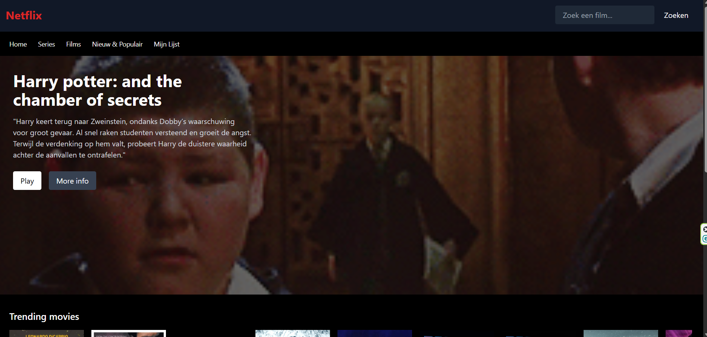

# Netflix Clone – TailwindCSS

Dit project is een zelfgemaakte Netflix‑clone gebouwd met HTML en TailwindCSS.  
De website bevat meerdere pagina’s zoals Home, Films, Series, Nieuw & Populair, Mijn Lijst, Play en Info.  
Daarnaast zijn er **vier aparte mappen**, elk met dezelfde pagina’s, om het gevoel te creëren dat er vier verschillende Netflix‑accounts bestaan.

---

## Screenshot  
Zo ziet de website eruit:

---

## 🎭 Vier account-mappen
Het project bevat vier mappen die elk dezelfde pagina’s bevatten:

- Home (index.html)
- Films (films.html)
- Series (series.html)
- Nieuw & Populair (nieuw.html)
- Mijn Lijst (lijst.html)
- Play (play.html)
- Info (info.html)

Elke map stelt een **eigen Netflix-profiel** voor: Rick, Sanne, Kasper en Arne.  
De inhoud is hetzelfde, maar elke map heeft zijn eigen bestanden om het gevoel van meerdere gebruikers te creëren — net zoals echte Netflix‑profielen.

---

## 📌 Pagina-overzicht

### 1. **begin.html – Profielselectie**
Een Netflix‑stijl profielselectie met vier gebruikers.  
Elke profielfoto linkt naar de bijbehorende map met pagina’s.

**Features**
- Vier profielen  
- TailwindCSS styling  
- Donkere Netflix‑look  

---

### 2. **index.html – Homepagina**
De homepage toont een grote hero‑banner met Harry Potter, inclusief beschrijving en knoppen.

**Features**
- Hero‑banner  
- Play & More Info  
- Trending movies  
- Trending series  
- Navigatiebalk + zoekfunctie  

---

### 3. **films.html – Filmoverzicht**
Overzicht van verschillende filmcategorieën.

**Features**
- Trending films  
- Harry Potter collectie  
- Christmas collectie  
- Horizontaal scrollbare rijen  
- Navigatiebalk + zoekfunctie  

---

### 4. **series.html – Seriesoverzicht**
De seriespagina toont Stranger Things als hero‑banner en een lijst met populaire series.

**Features**
- Hero‑banner (Stranger Things)  
- Play & More Info  
- Populaire series  
- Horizontaal scrollbare rijen  
- Navigatiebalk + zoekfunctie  

---

### 5. **nieuw.html – Nieuw & Populair**
Overzicht van populaire films, populaire series en nieuwe releases.

**Features**
- Populaire films  
- Populaire series  
- Nieuwe releases  
- Horizontaal scrollbare secties  
- Navigatiebalk + zoekfunctie  

---

### 6. **lijst.html – Mijn Lijst**
De pagina toont films en series die de gebruiker heeft opgeslagen.

**Features**
- Opslagweergave voor films  
- Opslagweergave voor series  
- Horizontaal scrollbare rijen  
- Navigatiebalk + zoekfunctie  

---

### 7. **play.html – Afspeelpagina**
Minimalistische afspeelpagina met fullscreen banner.

**Features**
- Fullscreen hero‑banner  
- Donkere overlay  
- Navigatiebalk + zoekfunctie  

---

### 8. **info.html – Informatiepagina**
Een eenvoudige informatiepagina waarin één gekozen film of serie centraal staat.

**Description**
Een grote hero‑banner met donkere overlay, een korte beschrijving van de titel en dezelfde Netflix‑stijl navigatie en zoekfunctie.  
Dit scherm geeft extra context voordat de gebruiker verder kijkt.

---

## 🎨 Styling
Alle pagina’s zijn volledig gestyled met **TailwindCSS** via CDN.  
De website gebruikt een donkere Netflix‑look met rode accenten, hover‑effecten en horizontale scroll‑secties.

---

## 🧱 Bestandsstructuur (voorbeeld)
